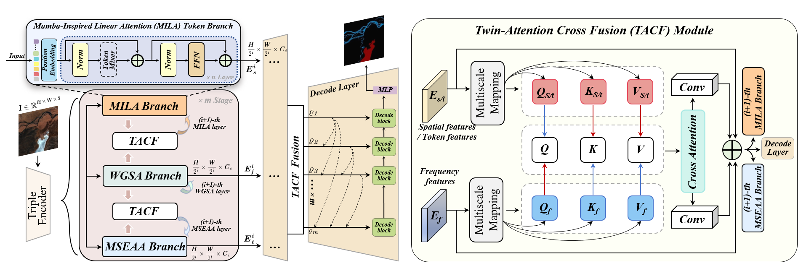
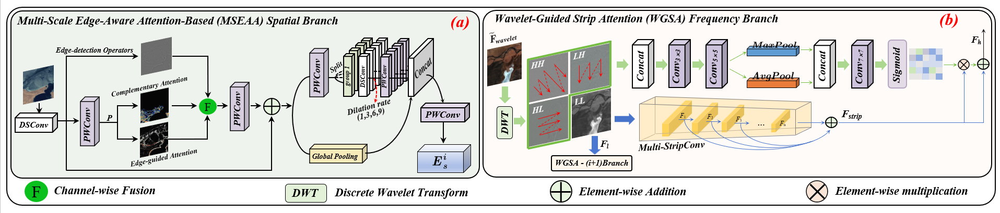

# FTSD-SegNet: A Frequency-Token-Spatial Domain Fused Segmentation Network for Extracting Environmental Objects from Remote Sensing Images

    

    

> <h2>The complete model code will be made public successively after the paper is accepted for publication.</h2>
